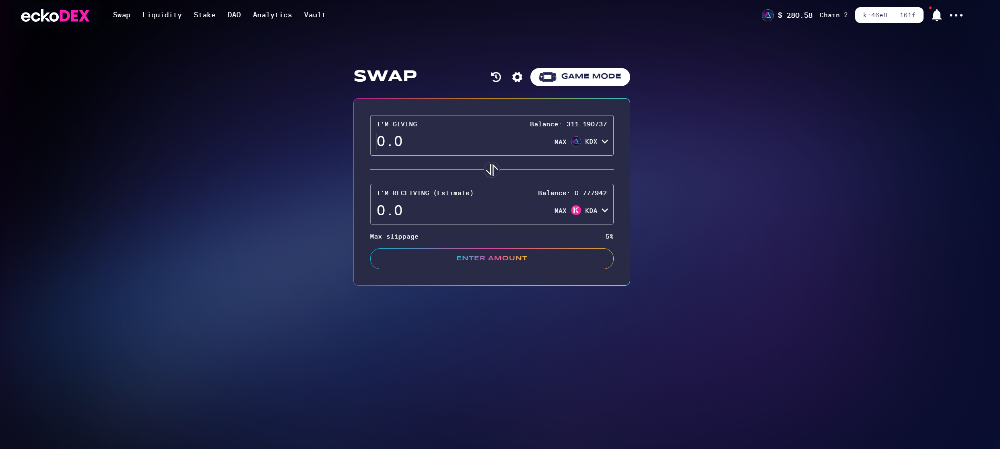

# Assets Directory

This directory contains all assets from the original eckoDAO Gitbook documentation.

## Directory Structure

```
assets/
├── images/              # Logos, icons, and cover images
│   └── tutorials/       # Tutorial screenshots
├── brand-packs/         # Downloadable brand asset archives
└── audits/             # Security audit documents
```

## Images

### Logos and Branding

- **eckoDAO_logo_dark.png** - Main eckoDAO dark logo (178 KB)
- **eckoDAO_icon.png** - eckoDAO favicon/icon
- **eckoDAO_gitbook_cover.png** - eckoDAO Gitbook cover image (1.5 MB)
- **eckoDEX_gitbook_cover.png** - eckoDEX Gitbook cover image (1.5 MB)

### Tutorial Screenshots

Located in `images/tutorials/`:

#### How to Swap Tutorial
- swap1-new.png
- swap2-new.png
- swap3.png
- swap4-new1.png

#### How to Add Liquidity Tutorial
- liquidity1-new.png (594 KB)
- liquidity2-new.png (1.0 MB)
- liquidity3-new.png (1.1 MB)
- liquidity4.png (1.2 MB)
- liquidity5-new.png (185 KB)
- liquidity6-new.png (412 KB)

#### WalletConnect Tutorial
- walletconnect1.png (307 KB)
- walletconnect2.png (204 KB)
- walletconnect3.png (605 KB)
- walletconnect4-qr.png (605 KB)

#### Migrate Liquidity Tutorial
- migrate1.png (636 KB)
- migrate2.png (428 KB)
- migrate3.png (598 KB)
- migrate4.png (561 KB)
- migrate5.png (628 KB)
- migrate6.png (675 KB)
- migrate7.png (1.1 MB)

## Brand Packs

Located in `brand-packs/`:

- **ecko_rebranding_logos.zip** (4.3 MB) - Official eckoDAO brand assets including logos in various formats
- **eckoWALLET_brand_assets.zip** (1.6 MB) - Official eckoWALLET brand assets

## Audits

Located in `audits/`:

- **Kaddex_AMM_Cryptography_and_Implementation_Review.pdf** (1.4 MB) - NCC Group security audit from July 14, 2022

## Usage in Documentation

To reference these assets in your markdown files, use relative paths:

```markdown


```

Or for Gitbook, you may need to adjust paths based on your configuration.

## Note

All assets are from the original documentation at https://docs.eckowallet.com and are preserved here for backup purposes.
