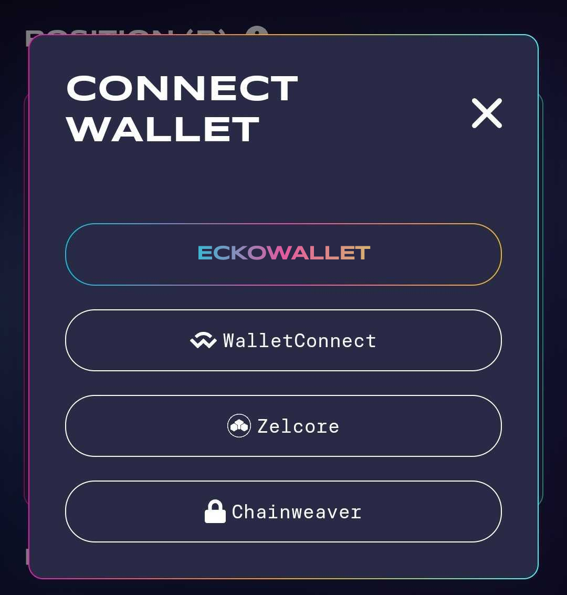
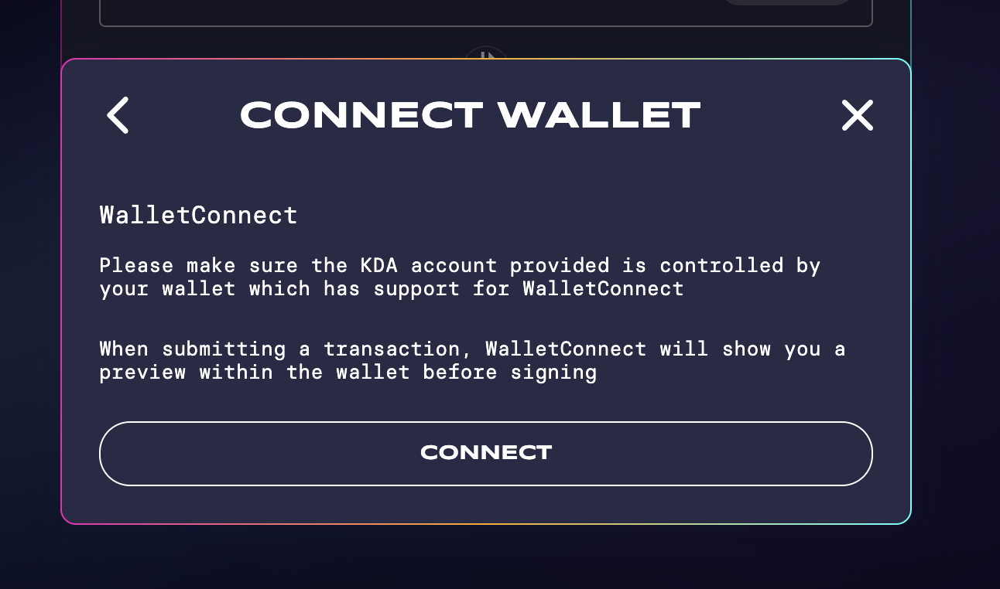
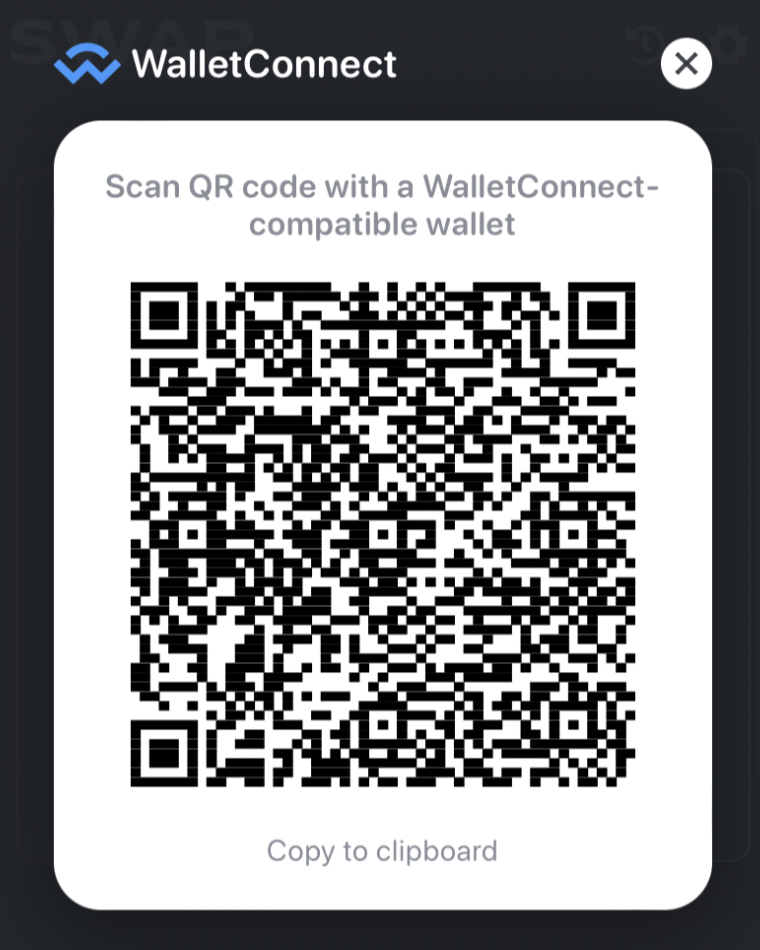

# WalletConnect

### 1- Connection Code

#### Step 1: click on "WalletConnect"

#### Step 2: click on "Connect"

#### Step 3: click on "Copy to clipboard"

#### Step 4: open your eckoWALLET mobile App

#### Step 5: navigate to “Connections”

#### Step 6: click on the WalletConnect Icon

#### Step 7: paste (Step 3) into the dedicated Connection Code field

#### Step 8: click on “Connect”

#### --> Follow the final steps as prompted by your eckoWALLET App.

## 2- QR Code

#### Step 1: click on "WalletConnect"

#### Step 2: click on "Connect"

#### Step 3: keep the new tab with the QR Code opened

#### Step 4: open your eckoWALLET mobile App

#### Step 5: go to “Connections”

#### Step 6: scan your QR Code

#### --> Follow the final steps as prompted by your eckoWALLET mobile App